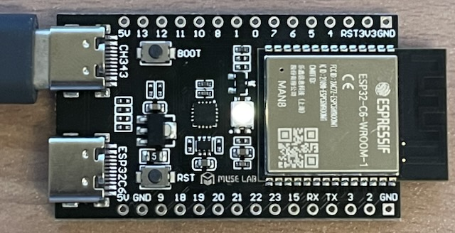
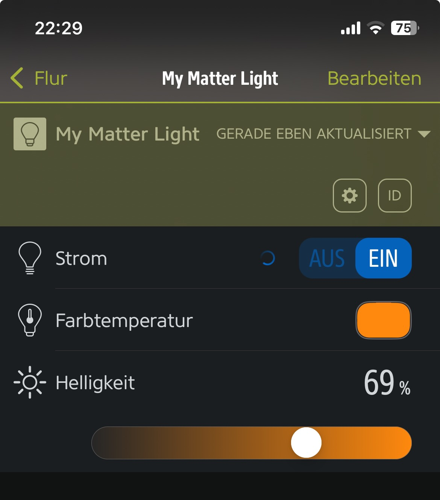
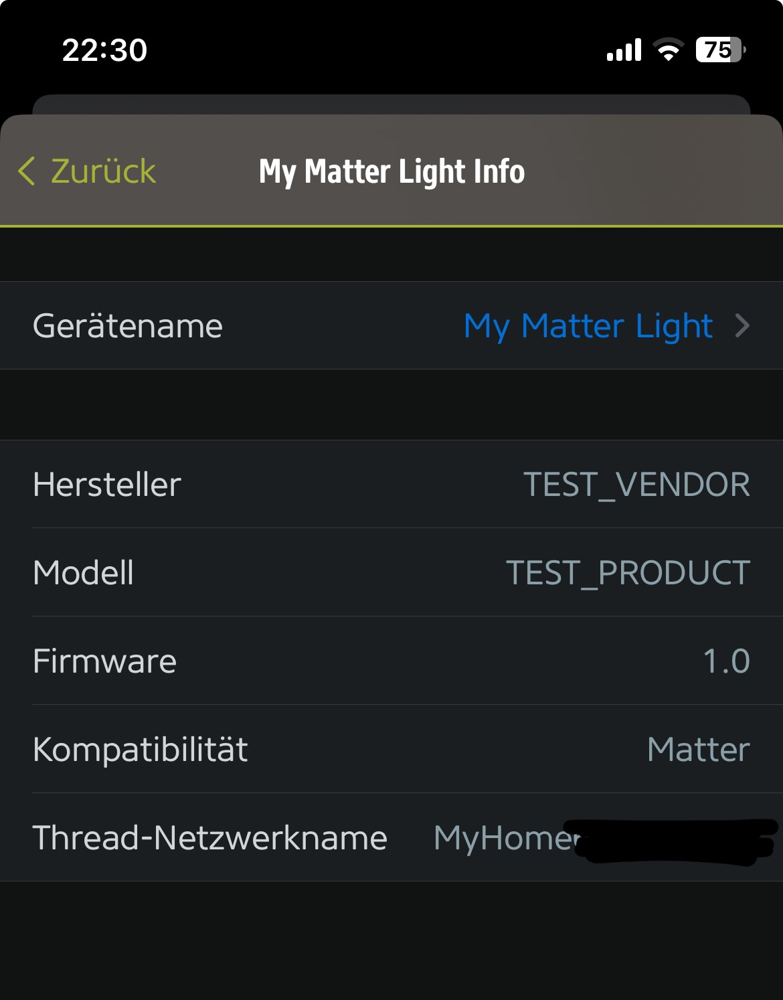

# ESP32-C6: Matter over Thread

This guide shows how to build the simple `light` example from the esp-matter SDK for the ESP32-C6 to use Matter over Thread - because if you just build that example according to the official instructions, it will use Matter over WiFi instead. If you build the example for the ESP32-H2 (which only has Thread and BLE, but no WiFi - unlike the ESP32-C6), it will likely "just work" out of the box.

However, I bought he ESP32-C6 for more versatility and it was a little bit cheaper at the time of buying. Also the ESP32-H2 was still only available as a dev kit without ADC calibrated etc.

The light example lets you control the onboard LED with the following setting with Matter over Thread: On/Off, brightness, hue (no RGB).

This guide uses the "ESP32-C6-WROOM-1-N8" on the "nanoESP32-C6 Development Board" used for this example:



## Step by Step instructions

This guide assumes you have already set up the following environment:
1. ESP-IDF v5.1.1: https://github.com/espressif/esp-idf/releases/tag/v5.1.1 (placed in: `~/esp/esp-idf/`)
1. ESP-Matter SDK: https://github.com/espressif/esp-matter (placed in: `~/esp/esp-matter/`)
1. Drivers for the UART (USB-to-Serial) controller of your development board has to be installed to flash the board and communicate with it. In my example, it's the CH343 chip. Could also be FTDI in your case, however that's not in the scope of these instruction.

Set up your environment:

```bash
source ~/esp/esp-idf/export.sh
source ~/esp/esp-matter/export.sh
```

Now copy the `light`-example from `~/esp/esp-matter/examples/light` to another directory, where you want to work with it. In the terminal, switch to that working directory, e.g.:

```bash
cp -r ~/esp/esp-matter/examples/light ~/git/my-matter-light
cd ~/git/my-matter-light
```

Prepare your configuration and ESP32-C6:
```bash
# configure target platform (ESP32-C6)
idf.py set-target esp32c6

# clear flash just to be safe, should normally not be necessary
idf.py erase_flash
```

Now enter the menuconfig to adjust some settings. The default example would simply use Matter-over-WiFi, but we want to use Matter-over-Thread here:

```bash
# to search for symbols, press "/"-key (don't include the "CONIFG_" in the search term)
idf.py menuconfig
```

Adjust the following settings:

```text
# Enable OpenThread
CONFIG_OPENTHREAD_ENABLED=y
CONFIG_OPENTHREAD_SRP_CLIENT=y
CONFIG_OPENTHREAD_DNS_CLIENT=y
CONFIG_OPENTHREAD_LOG_LEVEL_DYNAMIC=n
CONFIG_OPENTHREAD_LOG_LEVEL_NOTE=y
CONFIG_OPENTHREAD_CLI=n

# Disable lwip ipv6 autoconfig
CONFIG_LWIP_IPV6_AUTOCONFIG=n

# LwIP config for OpenThread
CONFIG_LWIP_IPV6_NUM_ADDRESSES=8
CONFIG_LWIP_MULTICAST_PING=y

# MDNS platform
CONFIG_USE_MINIMAL_MDNS=n
CONFIG_ENABLE_EXTENDED_DISCOVERY=y

# Disable WiFi on esp32c6
CONFIG_ENABLE_WIFI_STATION=n
CONFIG_ENABLE_WIFI_AP=n
```

Save the config and exit the dialog. Now you can build the source code (that might take a couple of minutes):

```bash
# build source code (should not give any errors)
idf.py build
```

If everything worked, you should now be able to flash the binary to the ESP32-C6 and connect to it's serial debug console:
```bash
# flash binary to ESP32-C6 and start monitor for logs / serial console
idf.py flash monitor
```

After the flash process is done, you should be able to add the ESP32-C6 matter device to your Thread network by scanning this QR code with your favourite app (e.g. with the Apple Home app or Eve app on iPhone, if you use the Apple TV or HomePod as your Thread border router):


(this is the "standard" matter example QR code with some default values - in the real world you'd obviously want to use unique QR codes and IDs etc. for every single matter device)

Now you should be connected and it could look something like this in the EVE app:

Eve App Overview             |  Eve App Details
:-------------------------:|:-------------------------:
  |  

Congratulations, you are done! Now you can adjust the example to your liking or try a different one. Having a "minimal working example" (MWE) first, helps a lot, though.